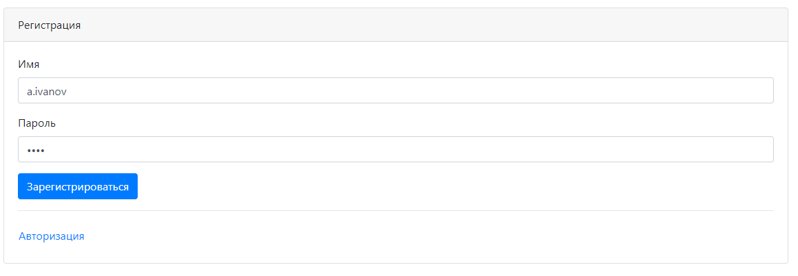
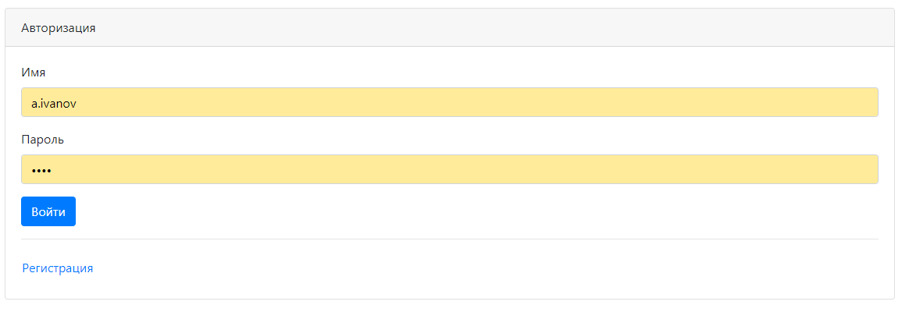
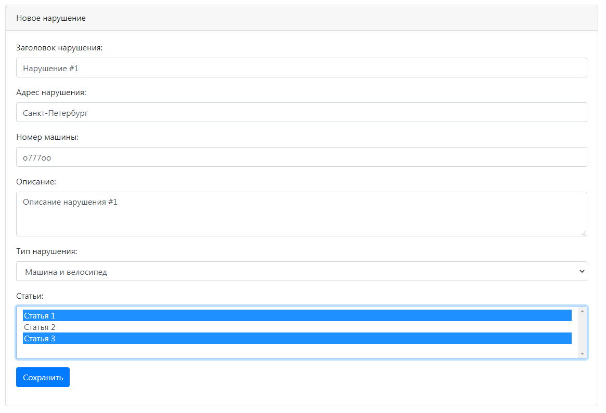
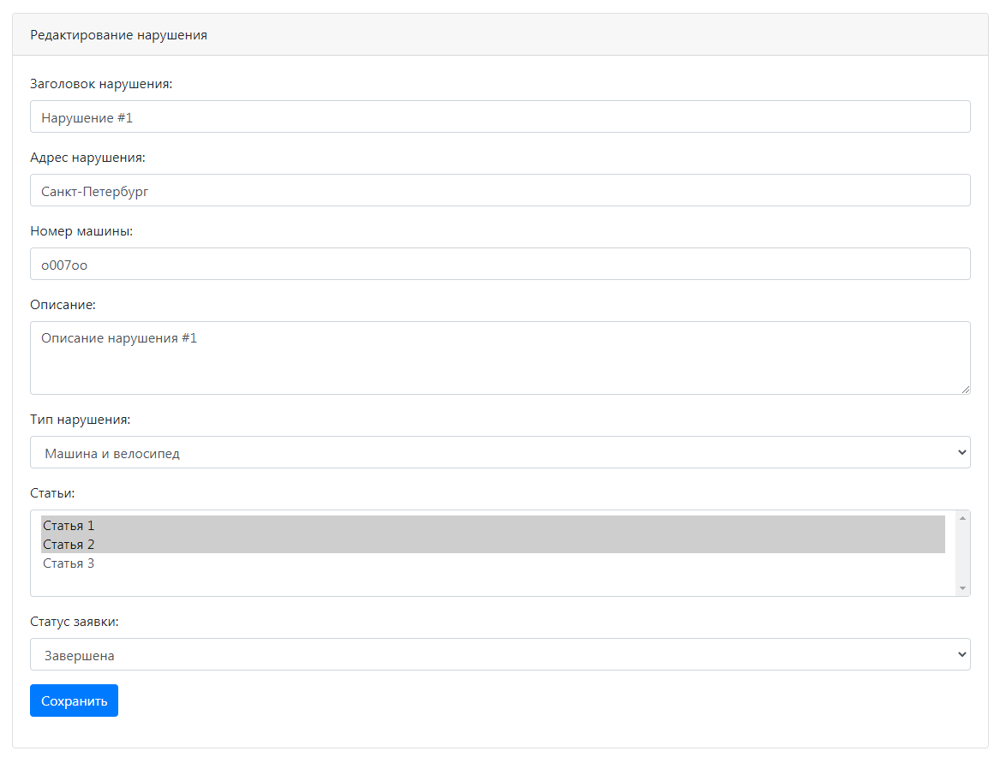
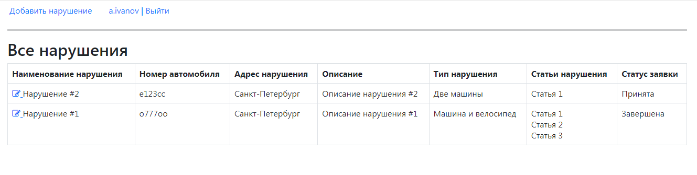

Проект "Автонарушители"
=========================================

**О проекте:**
==

Проект предназначен для изучения работы с фремворком Spring и его модулями: MVC, ORM, Data, Security.
Данное приложение является сервисом для ведения учета автонарушений.
Пользователями данной системы являются автоинспекторы. 
Они могут добавлять автонарушение в виде заявки, редактировать заявку, менять ее статус. 
Также в приложении есть регистрация и авторизация.

**Используемые технологии:**
==
- Java 12
- Spring (MVC, ORM, Data, Security), JSP, JSTL
- PostgreSQL, Hibernate, JDBC
- Maven, Tomcat

**Пользовательский интерфейс:**
==
Регистрация пользователя

Авторизация пользователя

Добавление нового нарушения

Редактирование нарушения, изменение статуса

Просмотр всех нарушений

**Контакты:**

